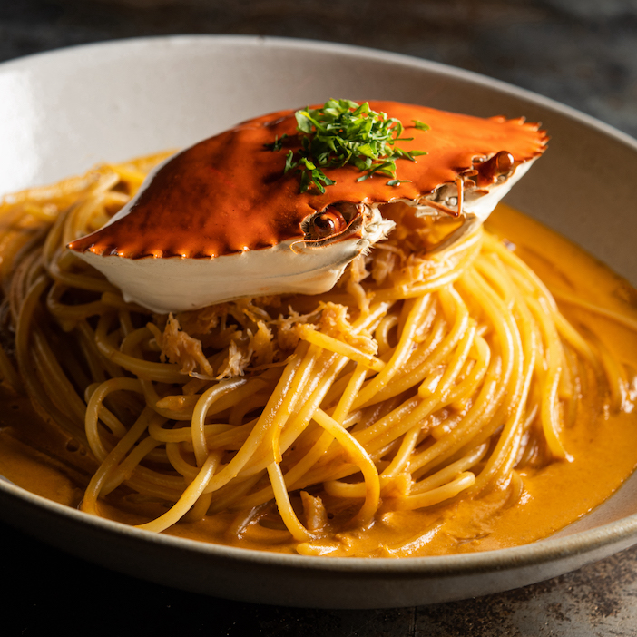

Điểm đặc biệt của các sản phẩm pasta hay 4P's Original Mì Ý Kem Cà Chua với thịt Cua đều đến từ nguyên liệu "homemade". Từ nước sốt, pho mát đều do 4Ps tự phát triển. 4P's vượt xa những món mì hay pizza truyền thống trong lịch sử với sự đổi mới không ngừng, mang đến những hương vị "độc nhất vô nhị" không lẫn vào đâu được.

Bất cứ ai là tín đồ của món 4P's Original Mì Ý Kem Cà Chua với thịt Cua và pasta đều biết đến các loại phô mai tự làm của 4P. Các dòng phô mai này được 4Ps nghiên cứu và tìm hiểu và sản xuất riêng cho từng chiếc bánh pizza cũng như từng món mì. Vì vậy, khi cân nhắc và thưởng thức, thực khách dễ dàng nhận ra hương vị độc đáo của món mì ý thơm ngon này.

Món Mì Ý Kem Cà Chua với thịt Cua của 4P không chỉ được tạo ra từ những nguyên liệu tự làm được lựa chọn kĩ lưỡng mà còn đến từ sự tìm tòi và học hỏi không ngừng về thương hiệu, đây là sự giao thoa giữa ẩm thực Á -  u tạo nên sự tương thích với nhiều khẩu vị từ đó tạo nên món 4P's Original Mì Ý Kem Cà Chua với thịt Cua ngon đúng vị người Việt.
